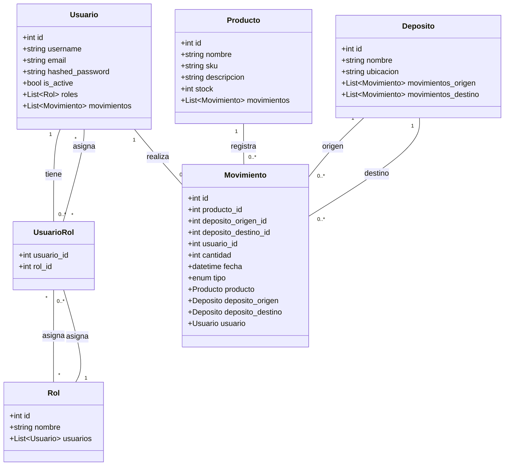

```mermaid
classDiagram
    class Usuario {
        +int id
        +string username
        +string email
        +string hashed_password
        +bool is_active
        +List~Rol~ roles
        +List~Movimiento~ movimientos
    }

    class Rol {
        +int id
        +string nombre
        +List~Usuario~ usuarios
    }

    class UsuarioRol {
        +int usuario_id
        +int rol_id
    }

    class Producto {
        +int id
        +string nombre
        +string sku
        +string descripcion
        +int stock
        +List~Movimiento~ movimientos
    }

    class Deposito {
        +int id
        +string nombre
        +string ubicacion
        +List~Movimiento~ movimientos_origen
        +List~Movimiento~ movimientos_destino
    }

    class Movimiento {
        +int id
        +int producto_id
        +int deposito_origen_id
        +int deposito_destino_id
        +int usuario_id
        +int cantidad
        +datetime fecha
        +enum tipo
        +Producto producto
        +Deposito deposito_origen
        +Deposito deposito_destino
        +Usuario usuario
    }

    Usuario "1" -- "0..*" Movimiento : realiza
    Usuario "1" -- "0..*" UsuarioRol : tiene
    Rol "1" -- "0..*" UsuarioRol : asigna
    UsuarioRol "*" -- "*" Usuario : asigna
    UsuarioRol "*" -- "*" Rol : asigna

    Producto "1" -- "0..*" Movimiento : registra
    Deposito "1" -- "0..*" Movimiento : origen
    Deposito "1" -- "0..*" Movimiento : destino


```