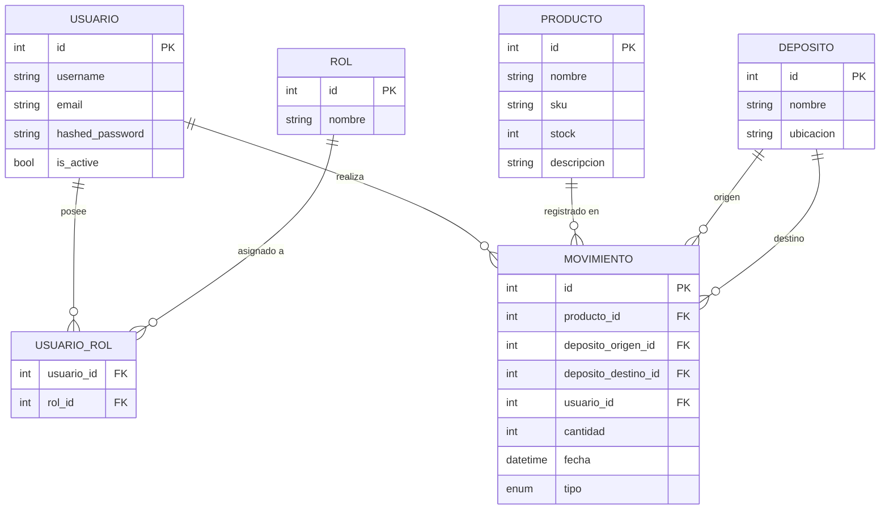

```mermaid
erDiagram
    USUARIO {
        int id PK
        string username
        string email
        string hashed_password
        bool is_active
    }
    ROL {
        int id PK
        string nombre
    }
    USUARIO_ROL {
        int usuario_id FK
        int rol_id FK
    }
    PRODUCTO {
        int id PK
        string nombre
        string sku
        int stock
        string descripcion
    }
    DEPOSITO {
        int id PK
        string nombre
        string ubicacion
    }
    MOVIMIENTO {
        int id PK
        int producto_id FK
        int deposito_origen_id FK
        int deposito_destino_id FK
        int usuario_id FK
        int cantidad
        datetime fecha
        enum tipo
    }

    USUARIO ||--o{ USUARIO_ROL : "posee"
    ROL ||--o{ USUARIO_ROL : "asignado a"
    USUARIO ||--o{ MOVIMIENTO : "realiza"
    PRODUCTO ||--o{ MOVIMIENTO : "registrado en"
    DEPOSITO ||--o{ MOVIMIENTO : "origen"
    DEPOSITO ||--o{ MOVIMIENTO : "destino"

```